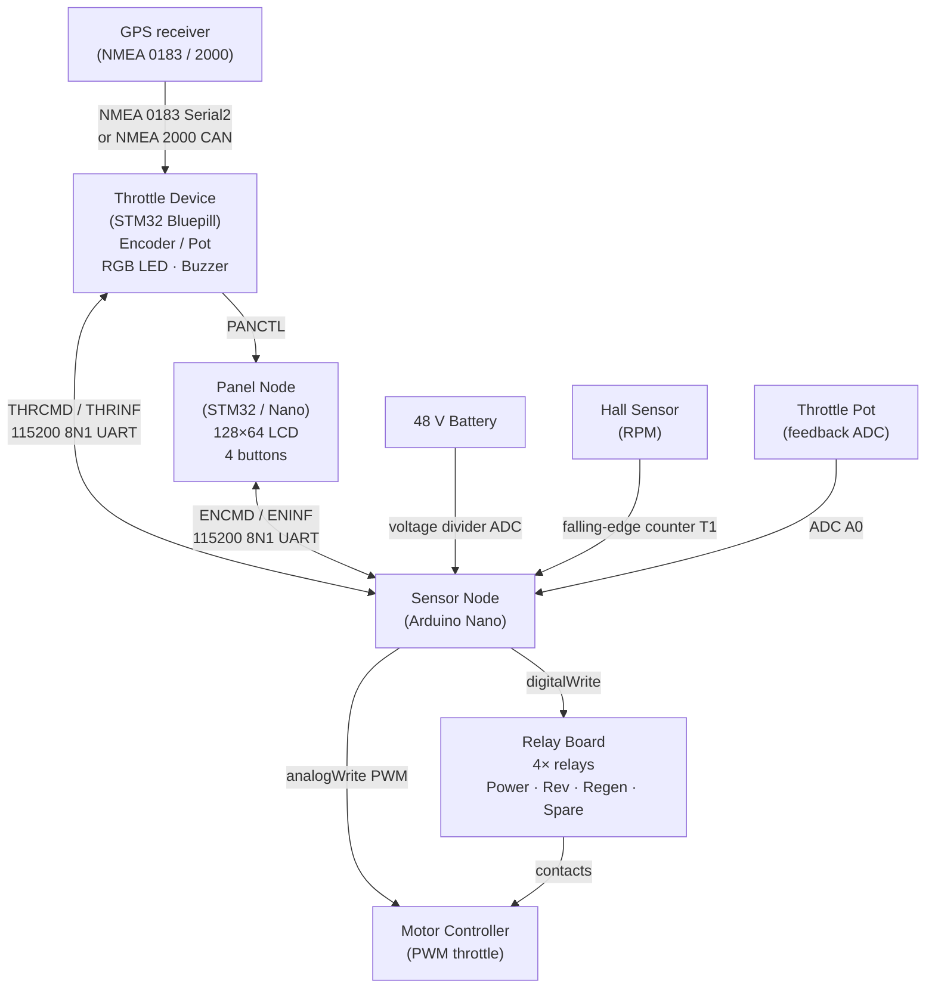

# Controls for DYI electric boat

[](https://github.com/navado/e-boat-pannel/actions/workflows/ci.yml)
[](LICENSE)

Firmware for a three-node electric-boat motor control system. A **sensor node** (Arduino Nano) reads hall-effect RPM pulses, a throttle potentiometer, and battery voltage, then drives four relays and a PWM throttle signal. A **panel node** (Arduino Nano or STM32 Bluepill) provides an SPI-connected 128×64 LCD display and four tactile buttons for the operator. An optional **throttle device** (STM32 Bluepill) adds an advanced control interface — potentiometer or quadrature encoder — with five PID-based control modes and NMEA 2000 / NMEA 0183 GPS integration. All three nodes communicate over a shared serial bus using a checksummed NMEA-0183-style protocol.

---

## Table of Contents

1. [System Architecture](#system-architecture)
2. [Hardware Bill of Materials](#hardware-bill-of-materials)
3. [Wiring Diagrams](#wiring-diagrams)
   - [Sensor Node (Arduino Nano)](#sensor-node--arduino-nano)
   - [Panel Node — STM32 Bluepill](#panel-node--stm32-bluepill)
   - [Panel Node — Arduino Nano (alternative)](#panel-node--arduino-nano-alternative)
   - [Throttle Device — STM32 Bluepill](#throttle-device--stm32-bluepill)
   - [System Interconnect (ASCII)](#system-interconnect)
   - [System Interconnect (Mermaid)](#system-connection-diagram)
4. [Communication Protocol](#communication-protocol)
5. [Throttle Control Modes](#throttle-control-modes)
6. [Throttle Table](#throttle-table)
7. [Safety Interlocks](#safety-interlocks)
8. [Building the Firmware](#building-the-firmware)
9. [Running the Tests](#running-the-tests)
10. [Project Layout](#project-layout)
11. [License](#license)

---

## System Architecture

```
  ┌──────────────────────────┐        ┌──────────────────────────────────┐
  │       PANEL NODE         │        │          SENSOR NODE             │
  │  (STM32 Bluepill or Nano)│        │         (Arduino Nano)           │
  │                          │  UART  │                                  │
  │  [BTN_A] Throttle UP  ─┐ │◄──────►│  ┌─ Relay: main power lock       │
  │  [BTN_B] Throttle DOWN─┤ │        │  ├─ Relay: reverse direction      │
  │  [BTN_C] Power toggle ─┤ │        │  ├─ Relay: regenerative braking   │
  │  [BTN_D] Regen toggle ─┘ │        │  └─ Relay: spare                 │
  │                          │        │                                  │
  │  ┌──────────────────┐    │        │  PWM ──► Motor controller        │
  │  │  ST7565 128×64   │    │        │                                  │
  │  │    LCD display   │    │        │  Hall sensor ──► RPM counter     │
  │  └──────────────────┘    │        │  Throttle pot ──► ADC           │
  └──────────────────────────┘        │  48 V bus ──► Voltage divider   │
                                      └──────────────┬───────────────────┘
  ┌──────────────────────────┐                       │ shared UART bus
  │    THROTTLE DEVICE       │◄──────────────────────┘
  │  (STM32 Bluepill)        │
  │                          │
  │  Pot / Encoder ──► position                                          │
  │  Mode encoder  ──► RPM/PWR/SOG/SOW/RNG                              │
  │  GPS (NMEA 0183/2000) ──► SOG, SOW, COG                             │
  │  RGB LED + Buzzer ──► status                                         │
  └──────────────────────────┘
```

### Serial bus messages

| Direction | Message | Trigger |
|-----------|---------|---------|
| Panel → Sensor | `$ENCMD,pow:on/off,rev:on/off,reg:on/off,thr:<0-255>*HH` | Any button press |
| Sensor → all | `$ENINF,<T>,<rpm>,<pow>,<rev>,<reg>,<thr>,<vthr>,<vcc>,...*HH` | Every 10 s |
| Throttle → Sensor | `$THRCMD,mode:<0-4>,target:<val>,thr:<0-255>*HH` | On position change |
| Throttle → all | `$THRINF,<T>,<mode>,<target>,<sog_kn10>,<sow_kn10>,<cog_deg>*HH` | Periodically |
| Throttle → Panel | `$PANCTL,pow:<on/off>*HH` | On panel power toggle |

---

## Hardware Bill of Materials

| Component | Qty | Notes |
|-----------|-----|-------|
| Arduino Nano (ATmega328P) | 2 | One for sensor, one for Nano-panel variant |
| STM32 Bluepill (F103C8) | 1–2 | Panel and/or throttle device; J-Link or ST-Link for first flash |
| ST7565-based 128×64 LCD | 1 | ERC12864 or compatible, 4-wire SPI |
| Tactile push-buttons | 4–6 | Normally open, 10 kΩ pull-down resistors |
| Hall-effect sensor | 1 | Open-drain NPN; 1 kΩ pull-up to 5 V |
| N-channel MOSFETs / relay board | 4 | 5 V coil, rated for motor current |
| Resistors: 1 kΩ, 100 kΩ | 1 each | Throttle pot voltage divider |
| Resistors: 470 kΩ, 20 kΩ | 1 each | 48 V battery voltage divider |
| RC low-pass filter (1 kΩ + 10 µF) | 1 | Smooths PWM throttle signal |
| Quadrature encoder (optional) | 1 | With push-button; for throttle device encoder variant |
| RGB LED (common-cathode) | 1 | Status indicator on throttle device |
| Passive buzzer | 1 | Audio feedback on throttle device |
| SN65HVD230 CAN transceiver (optional) | 1 | For NMEA 2000 GPS input |
| 48 V lithium battery pack | 1 | Nominal voltage; confirm relay ratings |

---

## Wiring Diagrams

### Sensor Node — Arduino Nano

```
Arduino Nano
─────────────────────────────────────────────────────────────
Pin  Label        Direction  Connected to
─────────────────────────────────────────────────────────────
D0   RX            IN         Shared bus TX  (Panel or Throttle device)
D1   TX            OUT        Shared bus RX
D2   RELAY_SPARE   OUT        Relay board IN4 (spare)
D4   RELAY_REGEN   OUT        Relay board IN3 (regenerative braking enable)
D5   T1/RPM        IN         Hall sensor OUT  ──[1 kΩ pull-up to 5 V]── VCC
                               (falling-edge counted by Timer 1; 6 pulses/rev)
D6   THROTTLE_OUT  OUT        RC filter ──[1 kΩ]──┬── Motor controller throttle IN
                                                   └──[10 µF]── GND
D7   RELAY_REV     OUT        Relay board IN2 (motor direction reversal)
D8   RELAY_LOCK    OUT        Relay board IN1 (main power lock)
D13  LED_BRD       OUT        On-board LED (heartbeat blink)
A0   THROTTLE_IN   IN         Throttle feedback divider:
                               48 V bus ──[470 kΩ]──┬── A0
                                                    └──[20 kΩ]── GND
A1   VCC_SENS_IN   IN         Battery voltage divider:
                               48 V bus ──[470 kΩ]──┬── A1
                                                    └──[20 kΩ]── GND
A2   BTN_A         IN         Button A (Throttle UP)   ──[10 kΩ pull-down]── GND
A3   BTN_B         IN         Button B (Throttle DOWN) ──[10 kΩ pull-down]── GND
A4   BTN_C         IN         Button C (Power toggle)  ──[10 kΩ pull-down]── GND
A5   BTN_D         IN         Button D (Regen toggle)  ──[10 kΩ pull-down]── GND
A6   CURR_SENS_IN  IN         Shunt amplifier output (50 mV/A)
─────────────────────────────────────────────────────────────

Relay board wiring (each relay independently):
  IN_n ──── Arduino output pin (active HIGH)
  COM  ──── 48 V bus or motor lead
  NO   ──── load (motor lead / power bus)
  NC   ──── leave disconnected (or use for safety tie-down)

Hall sensor wiring:
  VCC  ──── 5 V
  GND  ──── GND
  OUT  ──[1 kΩ pull-up]── 5 V
        └──── D5 (T1)
```

---

### Panel Node — STM32 Bluepill

```
STM32 Bluepill (F103C8)
─────────────────────────────────────────────────────────────
Pin   Label          Direction  Connected to
─────────────────────────────────────────────────────────────
A9    USART1 TX      OUT        Shared serial bus RX
A10   USART1 RX      IN         Shared serial bus TX
A0    RS_PIN         OUT        LCD RS  (register select / data-cmd)
A1    SCL_PIN        OUT        LCD SCL (serial clock)
A2    SDO_PIN        OUT        LCD SDO (serial data, MOSI)
A3    BACKLIGHT_PIN  OUT        LCD backlight anode  ──[100 Ω]── LED
B0    BTN_D          IN         Button D (Regen toggle)  ──[10 kΩ pull-down]── GND
B1    BTN_C          IN         Button C (Power toggle)  ──[10 kΩ pull-down]── GND
B10   BTN_B          IN         Button B (Throttle DOWN) ──[10 kΩ pull-down]── GND
B11   BTN_A          IN         Button A (Throttle UP)   ──[10 kΩ pull-down]── GND
PC13  LED_BRD        OUT        On-board LED (heartbeat, active LOW on Bluepill)
PC14  CS_PIN         OUT        LCD CS  (chip select, active LOW)
PC15  RST_PIN        OUT        LCD RST (reset, active LOW)
3.3   VCC            —          LCD VCC (3.3 V)
GND   GND            —          LCD GND, button common
─────────────────────────────────────────────────────────────

LCD ERC12864 (ST7565) SPI wiring:
  VDD ──── 3.3 V
  GND ──── GND
  CS  ──── PC14
  RST ──── PC15
  RS  ──── A0
  SCL ──── A1
  SDO ──── A2
  BLA ──[100 Ω]──── A3 (PWM backlight)
  BLK ──── GND

J-Link / ST-Link programming header (SWD):
  SWDIO ──── PA13
  SWCLK ──── PA14
  GND   ──── GND
  3.3 V ──── 3.3 V  (do NOT power from programmer if board is externally powered)

Level shifting (STM32 3.3 V ↔ Nano 5 V):
  STM32 TX → Sensor RX : direct connection (Nano RX tolerates 3.3 V)
  Sensor TX → STM32 RX : 10 kΩ / 20 kΩ voltage divider or dedicated level shifter
─────────────────────────────────────────────────────────────
```

---

### Panel Node — Arduino Nano (alternative)

```
Arduino Nano (panel variant, compile with -D PANNEL_NANO)
─────────────────────────────────────────────────────────────
Pin   Label          Direction  Connected to
─────────────────────────────────────────────────────────────
D0    RX             IN         Shared serial bus TX
D1    TX             OUT        Shared serial bus RX
D2    SCL_PIN        OUT        LCD SCL
D3    SDO_PIN        OUT        LCD SDO (MOSI)
D4    CS_PIN         OUT        LCD CS  (active LOW)
D5    RST_PIN        OUT        LCD RST (active LOW)
D6    BACKLIGHT_PIN  OUT        LCD backlight ──[100 Ω]── LED
D7    RS_PIN         OUT        LCD RS  (register select)
D9    BTN_D          IN         Button D ──[10 kΩ pull-down]── GND
D10   BTN_C          IN         Button C ──[10 kΩ pull-down]── GND
D11   BTN_B          IN         Button B ──[10 kΩ pull-down]── GND
D12   BTN_A          IN         Button A ──[10 kΩ pull-down]── GND
D13   LED_BRD        OUT        On-board LED (heartbeat)
5 V   VCC            —          LCD VCC (check LCD voltage spec; add 3.3 V LDO if needed)
GND   GND            —          LCD GND, button common
─────────────────────────────────────────────────────────────
```

---

### Throttle Device — STM32 Bluepill

The throttle device replaces or augments panel button-based throttle control with a high-resolution input device and closed-loop PID control modes.

```
STM32 Bluepill (F103C8) — Throttle Controller
─────────────────────────────────────────────────────────────
Pin   Label           Direction  Connected to
─────────────────────────────────────────────────────────────
A9    USART1 TX       OUT        Shared serial bus RX  (Sensor + Panel)
A10   USART1 RX       IN         Shared serial bus TX
A2    USART2 TX       OUT        (unused / debug)
A3    USART2 RX       IN         NMEA 0183 GPS  (4800 / 9600 baud, $GPRMC / $GPVTG)

— Throttle input (choose ONE variant at build time) ——————————
PA0   THROTTLE_POT    IN         Potentiometer wiper  (-D THROTTLE_POT)
                                   3.3 V ──[pot]──┬── PA0
                                                  └──[GND]
PB0   THROTTLE_ENC_A  IN         Quadrature encoder A  (-D THROTTLE_ENC)
PB1   THROTTLE_ENC_B  IN         Quadrature encoder B
                                   (5 V encoder: use 3.3 V level shifter or 10k divider)

— Mode-selector encoder ——————————————————————————————————————
PB3   MODE_ENC_A      IN         Mode selector encoder A
PB4   MODE_ENC_B      IN         Mode selector encoder B
PB5   MODE_ENC_BTN    IN         Encoder push-to-select / calibrate centre

— Control buttons (active LOW, INPUT_PULLUP) —————————————————
PB6   BTN_ENGINE      IN         Engine ON / OFF
PB7   BTN_PANEL       IN         Panel power ON / OFF  (long-press interlock)

— Status outputs —————————————————————————————————————————————
PA1   LED_R           OUT        RGB LED — Red   channel (PWM TIM2_CH2)
PA6   LED_G           OUT        RGB LED — Green channel (PWM TIM3_CH1)
PA7   LED_B           OUT        RGB LED — Blue  channel (PWM TIM3_CH2)
PA8   BUZZER          OUT        Passive buzzer  (tone() / PWM TIM1_CH1)
PC13  LED_BRD         OUT        Onboard LED (active LOW)

— NMEA 2000 CAN (optional, requires SN65HVD230 transceiver) —
PA11  CAN_RX          IN         CAN bus RX
PA12  CAN_TX          OUT        CAN bus TX

J-Link / ST-Link SWD:
  PA13 SWDIO,  PA14 SWCLK,  GND,  3.3 V
─────────────────────────────────────────────────────────────
```

**RGB LED status colours**

| Colour | Meaning |
|--------|---------|
| Green (solid) | Engine ON, throttle active |
| Blue (solid) | Engine OFF / idle |
| Yellow (pulsing) | Mode change in progress |
| Red | Safety interlock active or fault |

---

### System Interconnect

```
  ┌──────────────────────────┐              ┌──────────────────────────┐
  │       PANEL NODE         │              │       SENSOR NODE        │
  │   (STM32 or Nano)        │    UART      │     (Arduino Nano)       │
  │                          │  115200 8N1  │                          │
  │  USART TX ───────────────┼─────────────►│ RX (D0)                  │
  │  USART RX ◄──────────────┼──────────────┤ TX (D1)                  │
  │                          │              │                          │
  └──────────────────────────┘              └──────────┬───────────────┘
                                                       │ 115200 8N1
  ┌──────────────────────────┐                         │ (same RS-232 bus)
  │    THROTTLE DEVICE       │◄────────────────────────┘
  │   (STM32 Bluepill)       │
  │                          │◄──── NMEA 0183 GPS (Serial2, PA2/PA3)
  └──────────────────────────┘◄──── NMEA 2000 CAN  (PA11/PA12, optional)

  Notes:
  ─ All three nodes share one RS-232 bus (sensor D0/D1).
  ─ Panel and Throttle device connect as additional talkers/listeners.
  ─ STM32 I/O is 3.3 V; Nano sensor is 5 V:
      TX (STM32) → Nano RX : direct (Nano tolerates 3.3 V)
      TX (Nano)  → STM32 RX: 10 kΩ / 20 kΩ divider or level shifter
  ─ Motor controller, relays and 48 V power are on the sensor node only.
```

---

### System Connection Diagram



---

## Communication Protocol

Messages use an NMEA-0183-inspired framing:

```
$<PAYLOAD>*<XX>\n
 │              │└─ Newline (0x0A)
 │              └── Two hex digits: XOR checksum of all bytes in PAYLOAD
 └── PAYLOAD: comma-separated fields
```

### Panel → Sensor: `ENCMD`

```
$ENCMD,pow:<on|off>,rev:<on|off>,reg:<on|off>,thr:<0-255>*XX
```

| Field | Values | Meaning |
|-------|--------|---------|
| `pow` | `on` / `off` | Main power relay |
| `rev` | `on` / `off` | Reverse relay |
| `reg` | `on` / `off` | Regenerative-braking relay |
| `thr` | 0–255 | PWM throttle value from throttle table |

### Sensor → all: `ENINF`

```
$ENINF,<T>,<rpm>,<pow>,<rev>,<reg>,<thr>,<vthr>,<vcc>,<curr_ma>,<power_w>,<water_kn10>,<slip_pct10>*XX
```

| Field | Type | Meaning |
|-------|------|---------|
| `T` | ms | Uptime timestamp |
| `rpm` | uint | Motor RPM (TCNT1 / 6) |
| `pow` | 0/1 | Power relay state |
| `rev` | 0/1 | Reverse relay state |
| `reg` | 0/1 | Regen relay state |
| `thr` | 0–255 | Active throttle PWM value |
| `vthr` | 0–5000 | Throttle ADC mapped 0–5000 mV |
| `vcc` | mV | Battery voltage |
| `curr_ma` | mA | Motor current (shunt amplifier) |
| `power_w` | W | Motor shaft power (V × I) |
| `water_kn10` | kn×10 | Speed through water (from throttle device) |
| `slip_pct10` | %×10 | Propeller slip (signed; +ve = slipping) |

### Throttle → Sensor: `THRCMD`

```
$THRCMD,mode:<0-4>,target:<val>,thr:<0-255>*XX
```

| Field | Values | Meaning |
|-------|--------|---------|
| `mode` | 0–4 | Control mode index (see table below) |
| `target` | varies | Mode target: RPM, W, or knots×10 |
| `thr` | 0–255 | Computed PWM after PID |

### Throttle → all: `THRINF`

```
$THRINF,<T>,<mode>,<target>,<sog_kn10>,<sow_kn10>,<cog_deg>*XX
```

| Field | Type | Meaning |
|-------|------|---------|
| `T` | ms | Uptime |
| `mode` | 0–4 | Active control mode |
| `target` | varies | Current mode target value |
| `sog_kn10` | kn×10 | Speed over ground (from GPS) |
| `sow_kn10` | kn×10 | Speed through water (from impeller/NMEA) |
| `cog_deg` | degrees | Course over ground |

### Throttle → Panel: `PANCTL`

```
$PANCTL,pow:<on|off>*XX
```

Controls the panel LCD backlight / wake state remotely from the throttle device.

### Timing

| Event | Period |
|-------|--------|
| Button scan | 100 ms |
| Throttle / voltage ADC read | 100 ms |
| RPM counter latch | 1 s |
| `ENINF` telemetry transmit | 10 s |
| `ENCMD` command transmit | On change |
| `THRCMD` throttle command | On position change |
| `THRINF` status broadcast | 1 s |

---

## Throttle Control Modes

The throttle device selects its active mode via the mode-selector encoder. The sensor node reads `mode` and `target` from `THRCMD` / `THRINF` and applies them through the PID controller.

| Mode | Value | Target unit | PID feedback | Description |
|------|-------|-------------|--------------|-------------|
| `RPM` | 0 | RPM | `engine_state.rpm` | Direct RPM target; simplest mode |
| `PWR` | 1 | Watts | computed `V × I` | Constant power; battery-friendly |
| `SOG` | 2 | knots × 10 | GPS `sog_kn10` | Constant speed over ground |
| `SOW` | 3 | knots × 10 | impeller `sow_kn10` | Constant speed through water |
| `RNG` | 4 | — | efficiency ratio | Maximum range; minimises power for given SOW |

---

## Throttle Table

Speed index 5 is neutral. Below 5 is reverse, above 5 is forward. The PWM values match the motor controller's input range.

```
Index │  0    1    2    3    4  │  5  │  6    7    8    9   10
──────┼─────────────────────────┼─────┼──────────────────────────
PWM   │ 245  224  185  145  110 │  1  │ 110  145  185  224  254
Mode  │◄────── REVERSE ─────────┤STOP │──────── FORWARD ────────►
```

Long-press on throttle buttons jumps ±4 steps; short-press moves ±1 step.

The `throttle_table[]` array in `models.cpp` maps the 11-step index to a PWM value written to `THROTTLE_OUT` (D6) via `analogWrite()`.

---

## Safety Interlocks

The sensor firmware enforces the following guards against unsafe state transitions:

| Command | Blocked when |
|---------|-------------|
| Power OFF | Throttle PWM > 1 (motor still spinning) |
| Reverse toggle | Throttle > 1 **or** regen is active |
| Regen toggle | Throttle > 1 **or** reverse is active |
| Throttle change | Power is off **or** regen is active |

The panel firmware adds a second layer:

| Button action | Blocked when |
|--------------|-------------|
| Power toggle (BTN_C) | Speed ≠ neutral **or** regen is active |
| Regen toggle (BTN_D) | Power is off **or** speed ≠ neutral |
| Throttle change | Power is off **or** regen is active |

---

## Building the Firmware

### Prerequisites

- [PlatformIO Core](https://docs.platformio.org/en/latest/core/installation/index.html) (CLI or IDE plugin)
- For STM32 targets: J-Link or ST-Link debugger

```bash
cd devices/e-drive-sensor

# Sensor node (Arduino Nano)
pio run -e sensor

# Panel node — STM32 Bluepill
pio run -e stm-panel

# Panel node — Arduino Nano
pio run -e avr-pannel

# Throttle device — potentiometer input
pio run -e throttle-stm

# Throttle device — quadrature encoder input
pio run -e throttle-stm-enc
```

### Uploading

```bash
# Arduino Nano via USB:
pio run -e sensor         --target upload
pio run -e avr-pannel     --target upload

# STM32 Bluepill via J-Link:
pio run -e stm-panel      --target upload
pio run -e throttle-stm   --target upload
pio run -e throttle-stm-enc --target upload
```

### Build flags reference

| Flag | Effect |
|------|--------|
| `-D SENSOR` | Sensor node firmware |
| `-D PANNEL_STM32` | Panel node (Bluepill) |
| `-D PANNEL_NANO` | Panel node (Nano) |
| `-D THROTTLE_STM32` | Throttle device firmware |
| `-D THROTTLE_POT` | Use potentiometer input |
| `-D THROTTLE_ENC` | Use quadrature encoder input |
| `-D LOG_LEVEL=<0-4>` | Log verbosity: 0=DEBUG … 3=ERROR, 4=NONE |
| `-D PROP_PITCH_MM=<mm>` | Propeller pitch for slip calculation (default 600 mm) |
| `-D NMEA2000` | Enable NMEA 2000 CAN bus GPS input |

---

## Running the Tests

The test suite targets pure logic (tokenizer, checksum, command parser, throttle model) and requires only a C++14 compiler — no embedded hardware or PlatformIO native platform download needed.

```bash
cd devices/e-drive-sensor

g++ -std=c++14 -I include -I test \
    -D NATIVE_TEST -D LOG_LEVEL=4 \
    -Wall -Wextra -Werror \
    src/comms.cpp src/models.cpp test/test_main.cpp \
    -o /tmp/e_boat_tests && /tmp/e_boat_tests
```

Expected output:

```
PASS: test_tokenize_basic
PASS: test_tokenize_single_token
...
-----------------------
57 Tests  0 Failures
OK
```

Alternatively, once PlatformIO's native platform is downloaded:

```bash
pio test -e native
```

---

## Project Layout

```
e-boat-pannel/
└── devices/
    └── e-drive-sensor/         # Unified firmware project
        ├── platformio.ini      # Six build environments
        ├── include/
        │   ├── pinout.h        # Pin assignments for all board variants
        │   ├── models.h        # State structs, throttle table, PID, slip calc
        │   ├── comms.h         # Protocol types, log levels, function declarations
        │   ├── buttons.h       # Button debounce state machine & encoder types
        │   └── ui.h            # LCD display function declarations
        ├── src/
        │   ├── main-sensor.cpp   # Sensor node: relays, RPM, ADC, PWM throttle
        │   ├── main-pannel.cpp   # Panel node: buttons, LCD display, ENCMD sender
        │   ├── main-throttle.cpp # Throttle device: encoder/pot, PID modes, GPS
        │   ├── comms.cpp         # Serial framing, tokenizer, XOR checksum
        │   ├── models.cpp        # State init, throttle table, PID, prop slip
        │   ├── buttons.cpp       # Button debounce FSM, quadrature encoder decoding
        │   └── ui.cpp            # u8g2-based LCD rendering
        └── test/
            ├── test_main.cpp   # 57 unit tests (Unity framework)
            ├── unity.h         # Bundled minimal Unity test runner
            ├── Arduino.h       # Shim: redirects to mock_arduino.h
            └── mock_arduino.h  # Arduino API stub for native compilation
```

---

## License

GNU General Public License v3.0 — see [LICENSE](LICENSE).
